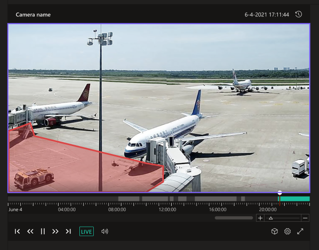

# Azure video analyzer widgets - under construction

[](https://opensource.org/licenses/MIT)
[](https://www.typescriptlang.org/)
[](https://github.com/prettier/prettier)

This is the Azure video analyzer widgets repo, containing web component packages, examples, and documentation.

## Introduction

A collection of widgets (web components) using Azure Video Analyzer platform capabilities and APIs

## Prerequisites

###### NOTE: this is relevant during development mode. After releasing to GITHUB, the flow will be updated.

1. #### For consuming at runtime:

    In this option, you can **build the library yourself** or **import the library from a blob**.
    _For building AVA widgets library_, please make sure you have access to the following repo - [AVA-Widgets](https://dev.azure.com/MediaWidgets/AVA%20Widgets)
    If not, please reach out to @Nofar Edan or @Ori Ziv to get access.

    _For importing the library from a blob_, please use the following file: https://salmon-mushroom-072389f0f.azurestaticapps.net/scripts.js

2. #### For consuming as NPM package from Azure private feed:

    Please make sure you have access to [AVA-Widgets](https://dev.azure.com/MediaWidgets/AVA%20Widgets/_packaging?_a=feed&feed=Media-AVA-Widgets) private feed.

    Then, connect to AVA-widgets feed:

    1. Enter [AVA-Widgets](https://dev.azure.com/MediaWidgets/AVA%20Widgets/_packaging?_a=feed&feed=Media-AVA-Widgets)
    2. Click on ‘Connect to feed’
    3. Select 'npm'
    4. Follow installation steps.

## Installing AVA library

###### NOTE: this is relevant during development mode. After releasing to GITHUB, the flow will be updated.

1. #### For building the library yourself:

    1. Clone repo code: [AVA-Widgets](https://dev.azure.com/MediaWidgets/AVA%20Widgets)
    2. Once cloned, enter repository location and write the following commands:
        ```
        npm install
        ```
        ```
        npm run build
        ```
        Once build is done, enter _/dist_ folder, there you will find _ava-widgets.js_ file.

2. #### For importing the library from a blob, you can skip this step.

3. #### For consuming as NPM package from Azure private feed:
    1. Create in your application an _.npmrc_ file and follow the steps in [Prerequisites](/widgets#for-consuming-as-npm-package-from-azure-private-feed)
    2. Install the library:
        ```
            npm install @video-analyzer/widgets
        ```

### `AVA player widget`

### Import

##### Native JS usage:

Import ava-widgets.js / https://salmon-mushroom-072389f0f.azurestaticapps.net/scripts.js to your HTML file:

```html live
<head>
    <script async type="”module”" src="./ava-widgets.js"></script>
</head>
```

```html live
<head>
    <script async type="”module”" src="https://salmon-mushroom-072389f0f.azurestaticapps.net/scripts.js"></script>
</head>
```

##### Typescript usage:

```typescript
import { Player } from '@video-analyzer/widgets';
```

### Getting Started

Player widget is a web-component that can be created using HTML or dynamically.

Creating using HTML:

```html live
  <body>
	<ava-player><ava-player>
  </body>
```

Creating dynamically:

##### Native JS usage:

```html live
<head>
    <script async type="”module”" src="https://salmon-mushroom-072389f0f.azurestaticapps.net/scripts.js"></script>
</head>
<body></body>
<script>
    (function () {
        const avaPlayer = new window.ava.widgets.player();
        document.firstElementChild.appendChild(avaPlayer);
    })();
</script>
```

##### Typescript usage:

```typescript
import { Player } from '@video-analyzer/widgets';

const avaPlayer = new Player();
document.firstElementChild.appendChild(avaPlayer).
```

### Properties

| Name   | Type             | Default | Description                         |
| ------ | ---------------- | ------- | ----------------------------------- |
| width  | string           | 100%    | Reflects the value of widget width  |
| height | string           | 100%    | Reflects the value of widget height |
| config | IAvaPlayerConfig | null    | Widget configuration                |

### Events

| Name          | Parameters | Description                                       |
| ------------- | ---------- | ------------------------------------------------- |
| TOKEN_EXPIRED | -          | Callback to invoke when AVA JWT token is expired. |

### Methods

| Name           | Parameters                                                               | Description                                                                                              |
| -------------- | ------------------------------------------------------------------------ | -------------------------------------------------------------------------------------------------------- |
| constructor    | width: string = '', height: string = '', config: IAvaPlayerConfig = null | Widget constructor. If called with config, you don’t need to call _configure_ function                   |
| setAccessToken | jwtToken:string                                                          | Update the widget token.                                                                                 |
| set apiBase    | apiBase:string                                                           | Control AVA-API base. Good for using mock API / testing API.                                             |
| configure      | config: IAvaPlayerConfig                                                 | Update widget configuration.                                                                             |
| load           | -                                                                        | Loads and initialize the widget according to provided configuration. If not called, widget will be empty |

### Code snippets:

1.  _Basic usage snippet:_ create a player widget with native JS code, configure the widget and load the data.

    ```html live
    <head>
        <script async type="”module”" src="https://salmon-mushroom-072389f0f.azurestaticapps.net/scripts.js"></script>
    </head>
    <body>
        <ava-player></ava-player>
    </body>
    <script>
        (function () {
                // Get player instance
                const avaPlayer = document.querySelector("ava-player");

                // Configure widget with AVA API configuration
                avaPlayer.configure({
                    token: '<AVA-API-JWT-TOKEN>',
                    accountId: '<GUID-ACCOUNT-ID>',
                    longRegionCode: '<REGION-CODE>',
                    videoName: '<VIDEO-NAME-FROM-AVA-ACCOUNT>’
                });

                avaPlayer.load();
            })()
    </script>
    ```

2.  _Token refresh snippet:_ create a widget with native JS code, configure the widget and load the data. Once AVA-API token is expired, update the token.

    ```html live
    <head>
        <script async type="”module”" src="https://salmon-mushroom-072389f0f.azurestaticapps.net/scripts.js"></script>
    </head>
    <body>
        <ava-player widget="”920px”" height="”300px”"></ava-player>
    </body>
    <script>
        (function () {
                    // Get player instance
                    const avaPlayer = document.querySelector("ava-player");

                    // Adding token expired listener
                    avaPlayer.addEventListener('TOKEN_EXPIRED', async () => {
                        const token = await fetch(‘<request-to-generate-token>’);
                        avaPlayer.setAccessToken(token);
                    });

                    // Configure widget with AVA API configuration
                    avaPlayer.configure({
                        token: '<AVA-API-JWT-TOKEN>',
                        accountId: '<GUID-ACCOUNT-ID>',
                        longRegionCode: '<REGION-CODE>',
                        videoName: '<VIDEO-NAME-FROM-AVA-ACCOUNT>’
                    });

                    // Load the widget
                    avaPlayer.load();
            })()
    </script>
    ```

3.  _Dynamically creating the widget:_ create a widget dynamically with native JS code, without using configure function.

    ```html live
    <head>
        <script async type="”module”" src="https://salmon-mushroom-072389f0f.azurestaticapps.net/scripts.js"></script>
    </head>
    <body>
        <div id="”widget-container”"></div>
    </body>
    <script>
        (function () {
                        // Get widget container
                        const widgetContainer = document.querySelector("#widget-container");

                        // Create new player widget
                        const playerWidget = new window.ava.widgets.player(
                        '100%',
                        '100%',
                        {
                                    token: '<AVA-API-JWT-TOKEN>',
                                    accountId: '<GUID-ACCOUNT-ID>',
                                    longRegionCode: '<REGION-CODE>',
                                    videoName: '<VIDEO-NAME-FROM-AVA-ACCOUNT>’
                        });

                        widgetContainer.appendChild(playerWidget)

                        // Load the widget
                        playerWidget.load();
                })()
    </script>
    ```

4.  _Use ava-player in your angular application:_

    1. Go to your _src/main.ts_ file and add the following code:

        ```typescript
        import { Player } from '@video-analyzer/widgets';

        /*
         * Ensure that tree-shaking doesn't remove this component from * the bundle.
         * There are multiple ways to prevent tree shaking, of which this * is one.
         */
        Player;
        ```

    2. To allow an NgModule to contain Non-Angular element names, add the following code in your application module typescript file _app.module.ts_:

        ```typescript
            import { CUSTOM_ELEMENTS_SCHEMA } from '@angular/core';

            @NgModule({
                schemas: [CUSTOM_ELEMENTS_SCHEMA]
            });
        ```

    3. Now we can start using widget. Replace the HTML template in your app.component.html, file with the following markup:
        ```html live
        <template>
            <ava-player></ava-player>
        </template>
        ```
        Alternatively, you can create a new instance of the widget using typescript, and add it to the DOM.

### Demo application:

https://aka.ms/ava-widgets-demo

### `AVA Zone Drawer widget`

##### Typescript usage:

```typescript
import { Player } from '@video-analyzer/widgets';
```

### Getting Started

Zone Drawer widget is a web-component that can be created using HTML or dynamically.

Creating using HTML:

```html live
  <body>
	<zone-drawer-widget><zone-drawer-widget>
  </body>
```
Creating dynamically:

##### Native JS usage:

```html live
<head>
    <script async type="”module”" src="https://salmon-mushroom-072389f0f.azurestaticapps.net/scripts.js"></script>
</head>
<body></body>
<script>
    (function () {
        const zoneDrawer = new window.ava.widgets.zoneDrawer();
        document.firstElementChild.appendChild(zoneDrawer);
    })();
</script>
```

##### Typescript usage:

```typescript
import { ZoneDrawer } from '@video-analyzer/widgets';

const zoneDrawer = new ZoneDrawer();
document.firstElementChild.appendChild(zoneDrawer).
```